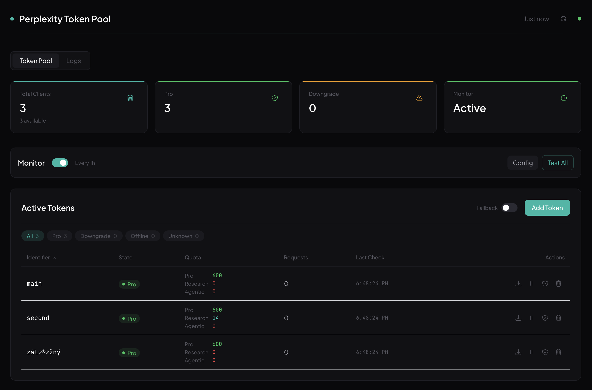
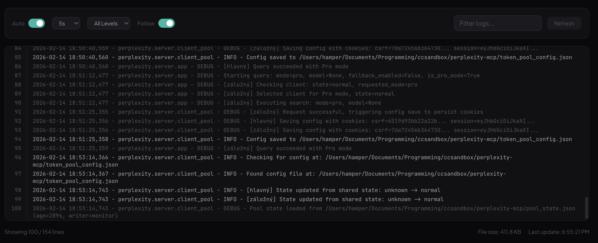

<div align="center">

<!-- Hero -->
<br />


<br /><br />

**Free Perplexity AI for your coding assistant.**
**No API keys. No subscription. Just plug and play.**

<br />

<a href="https://opensource.org/licenses/MIT"></a>&nbsp;
<a href="https://www.python.org/downloads/"></a>&nbsp;
<a href="https://modelcontextprotocol.io/"></a>&nbsp;
&nbsp;


<br /><br />

[Features](#-features) · [Quick Start](#-quick-start) · [Admin Panel](#-admin-panel) · [Configuration](#-configuration) · [Architecture](#-architecture)

<br />

</div>

---

## 🎯 Why Perplexity MCP?

Your AI coding assistant is only as good as its sources. Built-in web search gives you 10 blue links. **Perplexity gives you synthesized answers with citations** — from the latest docs, research papers, and community discussions.

<table>
<tr>
<th width="50%">❌ Without Perplexity</th>
<th width="50%">✅ With Perplexity MCP</th>
</tr>
<tr>
<td>

- Generic search results
- Outdated Stack Overflow answers
- Manual reading through pages
- No reasoning or analysis
- Single search engine

</td>
<td>

- **Synthesized answers** from multiple sources
- **Current documentation** and real-time data
- **Deep research** with 10-30+ citations
- **Multi-model reasoning** (GPT, Claude, Grok, Gemini)
- **Academic papers** via Scholar source

</td>
</tr>
</table>

---

## ✨ Features

<table>
<tr>
<td width="50%">

### 🔍 Smart Search
- **Pro Search** — fast, accurate answers with citations
- **Reasoning** — multi-model thinking for complex decisions
- **Deep Research** — comprehensive 10-30+ citation reports
- **Multi-source** — web, scholar, and social

### 🤖 Multi-Model Support
Choose from the latest AI models:
- `sonar` · `gpt-5.2` · `claude-4.5-sonnet` · `grok-4.1`
- `gpt-5.2-thinking` · `claude-4.5-sonnet-thinking`
- `gemini-3.0-pro` · `kimi-k2-thinking` · `grok-4.1-reasoning`

</td>
<td width="50%">

### 🏊 Token Pool
- **Round-robin** rotation across multiple accounts
- **Auto-failover** with exponential backoff
- **3-level fallback** — Pro → downgraded → anonymous
- **Silent downgrade protection** for deep research

### 📊 Admin Panel
- Real-time quota dashboard (Pro / Research / Agentic)
- Health monitoring with zero-cost API checks
- Token management — add, remove, enable/disable
- Telegram alerts on state changes
- Live log viewer with filtering

</td>
</tr>
</table>

---

## 🖼️ Screenshots

<div align="center">

### Token Pool Dashboard



<sub>Real-time overview — stats grid, monitor controls, token table with per-account quotas (Pro / Research / Agentic), filter pills, and one-click actions.</sub>

<br /><br />

### Log Viewer



<sub>Live log streaming with auto-refresh, level filtering, search highlighting, follow mode, and line numbers.</sub>

</div>

---

## 🚀 Quick Start

### 1. Clone & Install

```bash
git clone https://github.com/teoobarca/perplexity-mcp.git
cd perplexity-mcp
uv sync
```

### 2. Add to Your AI Tool

<details>
<summary><b>🟣 Claude Code</b></summary>

```bash
claude mcp add perplexity -s user -- uv --directory /path/to/perplexity-mcp run perplexity-mcp
```
</details>

<details>
<summary><b>🟢 Cursor</b></summary>

Go to **Settings → MCP → Add new server** and paste:

```json
{
  "command": "uv",
  "args": ["--directory", "/path/to/perplexity-mcp", "run", "perplexity-mcp"]
}
```
</details>

<details>
<summary><b>🔵 Windsurf / VS Code / Other MCP clients</b></summary>

Add to your MCP config file:

```json
{
  "mcpServers": {
    "perplexity": {
      "command": "uv",
      "args": ["--directory", "/path/to/perplexity-mcp", "run", "perplexity-mcp"]
    }
  }
}
```
</details>

**That's it.** Works immediately with anonymous sessions. Add your tokens for Pro access — see [Authentication](#-authentication).

---

## 🛠️ Tools

The server exposes two MCP tools, designed with LLM-optimized descriptions:

### `perplexity_ask`

> AI-powered answer engine for tech questions, documentation lookups, and how-to guides.

| Parameter | Type | Default | Description |
|:----------|:-----|:--------|:------------|
| `query` | string | *required* | Natural language question with context |
| `model` | string | `null` | Model selection (see [models](#-multi-model-support)) |
| `sources` | array | `["web"]` | Sources: `web`, `scholar`, `social` |
| `language` | string | `en-US` | ISO 639 language code |

**Mode auto-detection:** Models with `thinking` or `reasoning` in the name automatically use **Reasoning mode** instead of Pro Search.

```
"gpt-5.2"          → Pro Search
"gpt-5.2-thinking"  → Reasoning Mode  ← auto-detected
```

### `perplexity_research`

> Deep research agent for comprehensive analysis. Returns extensive reports with 10-30+ citations.

| Parameter | Type | Default | Description |
|:----------|:-----|:--------|:------------|
| `query` | string | *required* | Detailed research question with full context |
| `sources` | array | `["web", "scholar"]` | Sources: `web`, `scholar`, `social` |
| `language` | string | `en-US` | ISO 639 language code |

> [!TIP]
> Deep research takes 2-5 minutes per query. Provide detailed context and constraints in your query for better results. The server has a 15-minute timeout to accommodate this.

---

## 🖥️ Admin Panel

A built-in web dashboard for managing your token pool. Start it with:

```bash
perplexity-server
```

Opens automatically at **`http://localhost:8123/admin/`**

### Dashboard Features

| Feature | Description |
|:--------|:------------|
| 📊 **Stats Grid** | Total clients, Pro/Downgrade counts, Monitor status |
| 📋 **Token Table** | Sortable columns, filter pills (Pro/Downgrade/Offline/Unknown), icon actions |
| 💰 **Quota Column** | Per-token breakdown — Pro remaining, Research quota, Agentic research |
| ❤️ **Health Monitor** | Zero-cost checks via rate-limit API, configurable interval, Telegram alerts |
| 🔄 **Fallback Toggle** | Enable/disable automatic Pro → free fallback per session |
| 📥 **Import/Export** | Bulk token management via JSON config files |
| 📝 **Log Viewer** | Live streaming, level filter (Error/Warning/Info/Debug), search, follow mode |
| 🧪 **Test Button** | Run health check on individual tokens or all at once |

---

## 🔐 Authentication

By default, the server uses **anonymous Perplexity sessions** (rate limited). For unlimited Pro access, add your session tokens.

### How to Get Tokens

1. Sign in at [perplexity.ai](https://perplexity.ai)
2. Open **DevTools** (F12) → **Application** → **Cookies**
3. Copy these two cookies:
   - `next-auth.csrf-token`
   - `next-auth.session-token`

### Single Token

Create `token_pool_config.json` in the project root:

```json
{
  "tokens": [
    {
      "id": "my-account",
      "csrf_token": "your-csrf-token-here",
      "session_token": "your-session-token-here"
    }
  ]
}
```

### Multi-Token Pool

Add multiple accounts for **round-robin rotation** with automatic failover:

```json
{
  "monitor": {
    "enable": true,
    "interval": 6,
    "tg_bot_token": "optional-telegram-bot-token",
    "tg_chat_id": "optional-chat-id"
  },
  "fallback": {
    "fallback_to_auto": true
  },
  "tokens": [
    { "id": "account-1", "csrf_token": "...", "session_token": "..." },
    { "id": "account-2", "csrf_token": "...", "session_token": "..." },
    { "id": "account-3", "csrf_token": "...", "session_token": "..." }
  ]
}
```

> [!NOTE]
> Session tokens typically last ~30 days. The monitor will detect expired tokens and alert you via Telegram if configured.

---

## ⚙️ Configuration

### Environment Variables

| Variable | Default | Description |
|:---------|:--------|:------------|
| `PERPLEXITY_TIMEOUT` | `900` | Request timeout in seconds (15 min for deep research) |
| `PERPLEXITY_MAX_RETRIES` | `2` | Retry attempts on transient failures |
| `PPLX_ADMIN_TOKEN` | — | Admin token for authenticated API endpoints |
| `SOCKS_PROXY` | — | SOCKS5 proxy URL (`socks5://host:port`) |

### Token States

The monitor detects four token states:

| State | Meaning | Badge | Behavior |
|:------|:--------|:------|:---------|
| 🟢 `normal` | Pro search available | **Pro** | Used for all requests |
| 🟡 `downgrade` | Pro quota exhausted | **Downgrade** | Skipped for Pro, used as auto fallback |
| 🔴 `offline` | Session invalid/expired | **Offline** | Not used for any requests |
| 🔵 `unknown` | Not yet checked | **Ready** | Used normally until first check |

### Fallback Chain

When a Pro request fails, the server tries progressively:

```
1. ✅ Next Pro client (round-robin)
2. ✅ Next Pro client ...
3. 🟡 First downgraded client (auto mode)
4. 🔵 Anonymous session (auto mode)
5. ❌ Error returned to caller
```

---

## 🏗️ Architecture

```
┌─────────────────────────────────────────────────────────┐
│  Your AI Assistant (Claude Code / Cursor / Windsurf)    │
└──────────────────────┬──────────────────────────────────┘
                       │ MCP (stdio)
                       ▼
┌──────────────────────────────────────────────────────────┐
│  perplexity-mcp                                          │
│  ┌────────────────┐  ┌────────────────────────────────┐  │
│  │  tools.py       │  │  server.py                     │  │
│  │  • ask          │──│  • Pool state sync             │  │
│  │  • research     │  │  • Timeout handling            │  │
│  └────────────────┘  └────────────────────────────────┘  │
└──────────────────────┬───────────────────────────────────┘
                       │
                       ▼
┌──────────────────────────────────────────────────────────┐
│  Backend Engine (perplexity/)                            │
│                                                          │
│  ┌─────────────┐  ┌──────────────┐  ┌────────────────┐  │
│  │  client.py   │  │  client_pool │  │  admin.py      │  │
│  │  • Search    │  │  • Rotation  │  │  • REST API    │  │
│  │  • Upload    │  │  • Backoff   │  │  • Static      │  │
│  │  • Validate  │  │  • Monitor   │  │    files       │  │
│  └──────┬───────┘  │  • Fallback  │  └────────┬───────┘  │
│         │          └──────────────┘           │          │
│         ▼                                     ▼          │
│  ┌─────────────┐                    ┌────────────────┐   │
│  │ Perplexity  │                    │ React Admin UI │   │
│  │ (web API)   │                    │ :8123/admin/   │   │
│  └─────────────┘                    └────────────────┘   │
└──────────────────────────────────────────────────────────┘
```

### Key Components

| Component | File | Role |
|:----------|:-----|:-----|
| **MCP Server** | `src/server.py` | Stdio transport, pool state sync, timeout handling |
| **Tool Definitions** | `src/tools.py` | 2 MCP tools with LLM-optimized descriptions |
| **API Client** | `perplexity/client.py` | Perplexity API via curl_cffi (bypasses Cloudflare) |
| **Client Pool** | `perplexity/server/client_pool.py` | Round-robin, backoff, monitor, state persistence |
| **Query Engine** | `perplexity/server/app.py` | Rotation loop, 3-level fallback, validation |
| **Admin API** | `perplexity/server/admin.py` | REST endpoints + static file serving |
| **Admin UI** | `perplexity/server/web/` | React + Vite + Tailwind dashboard |

### Downgrade Protection

The server prevents Perplexity from silently returning a regular Pro result when deep research is requested:

1. **Pre-request check** — skips clients with zero research quota before sending the request
2. **Post-response validation** — verifies the response structure matches deep research format (list of step objects, not a plain string)

---

## 🧪 Development

```bash
# Install in development mode
uv pip install -e ".[dev]" --python .venv/bin/python

# Run unit tests
.venv/bin/python -m pytest tests/test_config.py tests/test_utils.py tests/test_client_pool.py tests/test_research_downgrade.py -v

# Frontend development
cd perplexity/server/web
npm install
npm run dev      # Dev server with proxy to :8123
npm run build    # Production build
```

### Project Structure

```
src/                          # MCP stdio server (thin wrapper)
  server.py                   #   Entry point, pool state sync
  tools.py                    #   Tool definitions

perplexity/                   # Backend engine
  client.py                   #   Perplexity API client (curl_cffi)
  config.py                   #   Constants, endpoints, model mappings
  exceptions.py               #   Custom exception hierarchy
  logger.py                   #   Centralized logging
  server/
    app.py                    #   Starlette app, query engine
    client_pool.py            #   ClientPool, rotation, monitor
    admin.py                  #   Admin REST API
    utils.py                  #   Validation helpers
    main.py                   #   HTTP server entry point
    web/                      #   React admin frontend
      src/
        components/           #   UI components
          ui/                 #     Primitives (Toggle, StatCard, Modal, Toast)
          TokenTable.tsx      #     Token management table
          StatsGrid.tsx       #     Dashboard stats
          MonitorPanel.tsx    #     Health monitor controls
          logs/LogsPanel.tsx  #     Log viewer

tests/                        # Test suite (53 tests)
  test_config.py              #   Config validation
  test_utils.py               #   Utility functions
  test_client_pool.py         #   Pool logic, rotation, state
  test_research_downgrade.py  #   Downgrade protection
```

---

## ⚠️ Limitations

- **Unofficial** — uses Perplexity's web interface, may break if they change it
- **Cookie-based auth** — session tokens expire after ~30 days
- **Rate limits** — anonymous sessions have strict query limits
- **Deep research** — takes 2-5 minutes per query (this is normal)

---

## 📄 License

[MIT](LICENSE) — use it however you want.

---

<div align="center">

<sub>Built with ❤️ for the MCP ecosystem</sub>

</div>
